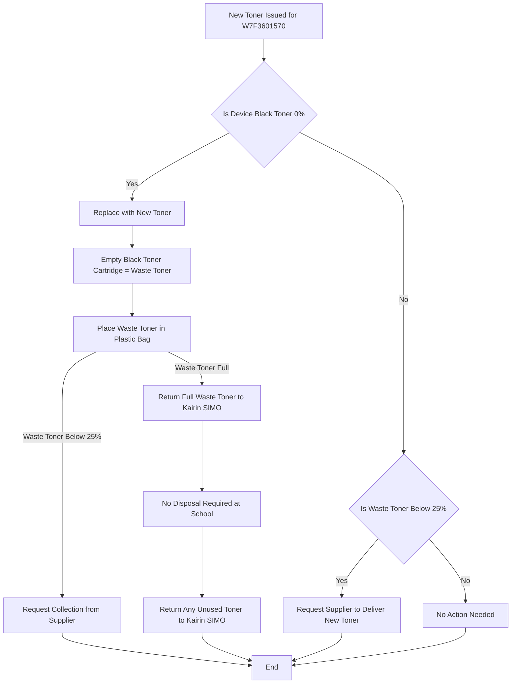

```mermaid
graph TD
    A[New Toner Issued for W7F3601570] --> B{Is Device Black Toner 0%}
    B -- Yes --> C[Replace with New Toner]
    B -- No --> L{Is Waste Toner Below 25%}
    C --> D[Empty Black Toner Cartridge = Waste Toner]
    D --> E[Place Waste Toner in Plastic Bag]
    E -- Waste Toner Below 25% --> F[Request Collection from Supplier]
    E -- Waste Toner Full --> G[Return Full Waste Toner to Kairin SIMO]
    G --> H[No Disposal Required at School]
    H --> I[Return Any Unused Toner to Kairin SIMO]
    F --> K[End]
    L -- Yes --> M[Request Supplier to Deliver New Toner]
    L -- No --> J[No Action Needed]
    J --> K
    I --> K
    M --> K
```
