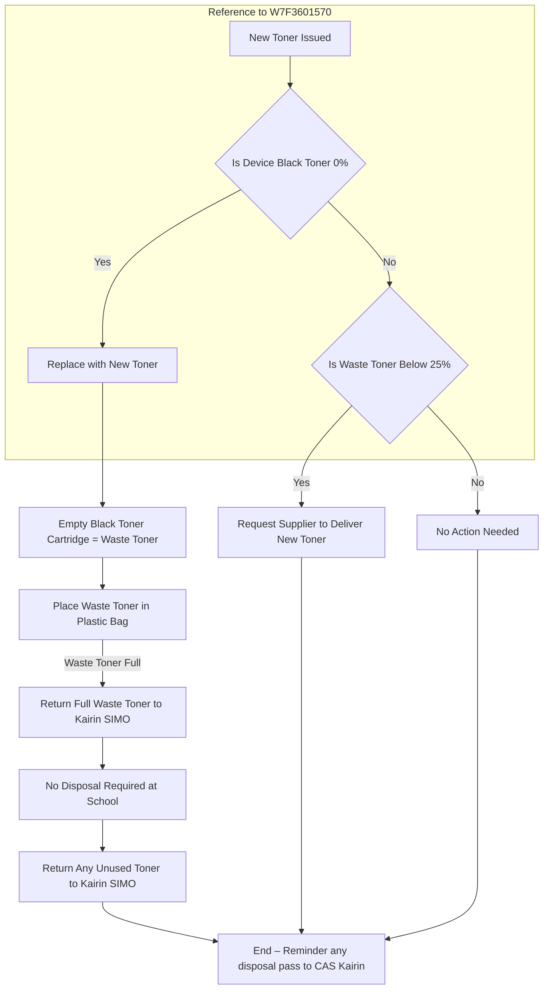

```mermaid
graph TD
subgraph Reference to W7F3601570
    A[New Toner Issued] --> B{Is Device Black Toner 0%}
    B -- Yes --> C[Replace with New Toner]
    B -- No --> L{Is Waste Toner Below 25%}
end
    C --> D[Empty Black Toner Cartridge = Waste Toner]
    D --> E[Place Waste Toner in Plastic Bag]
    E -- Waste Toner Full --> G[Return Full Waste Toner to Kairin SIMO]
    G --> H[No Disposal Required at School]
    H --> I[Return Any Unused Toner to Kairin SIMO]
    L -- Yes --> M[Request Supplier to Deliver New Toner]
    L -- No --> J[No Action Needed]
    J --> K[End – Reminder any disposal pass to CAS Kairin]
    I --> K
    M --> K
```
