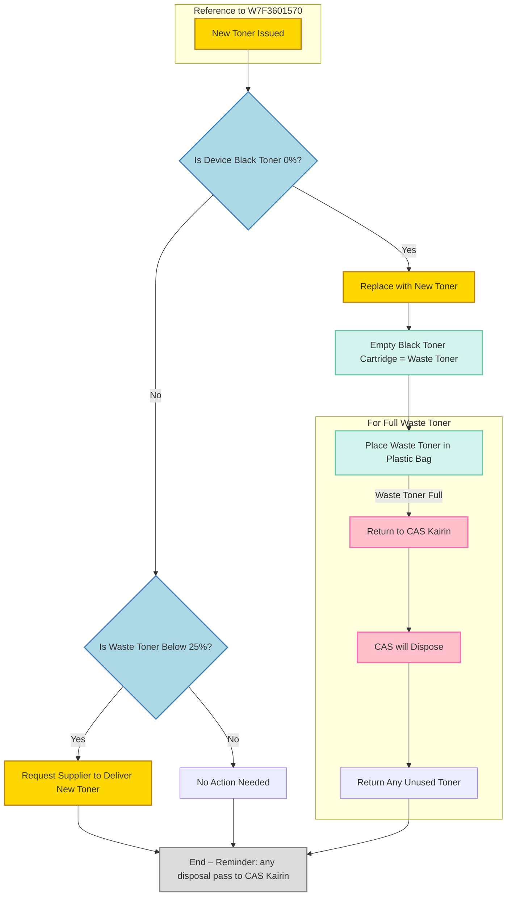

```mermaid

graph TD
    A[New Toner Issued] --> B{Is Device Black Toner 0%?}
    B -- Yes --> C[Replace with New Toner]
    C --> D[Empty Black Toner Cartridge = Waste Toner]
    D --> E[Place Waste Toner in Plastic Bag]
    B -- No --> L{Is Waste Toner Below 25%?}
    L -- Yes --> M[Request Supplier to Deliver New Toner]
    M --> K[End – Reminder: any disposal pass to CAS Kairin]
    L -- No --> J[No Action Needed]
    J --> K
    E -- Waste Toner Full --> G[Return to CAS Kairin]
    G --> H[CAS will Dispose]
    H --> I[Return Any Unused Toner]
    I --> K

    %% Subgraphs for visual grouping, optional
    subgraph "Reference to W7F3601570"
        A
    end
    subgraph "For Full Waste Toner"
        E
        G
        H
        I
    end

    %% Class Definitions for Styling
    classDef important fill:#FFD700,stroke:#B8860B,stroke-width:2px
    classDef decision fill:#ADD8E6,stroke:#4682B4,stroke-width:2px
    classDef process fill:#D3F3EE,stroke:#66CDAA,stroke-width:2px
    classDef disposal fill:#FFC0CB,stroke:#FF69B4,stroke-width:2px
    classDef endNode fill:#DCDCDC,stroke:#808080,stroke-width:2px

    %% Applying Classes to Nodes
    class A,C,M important
    class B,L decision
    class D,E process
    class G,H disposal
    class K endNode
```
