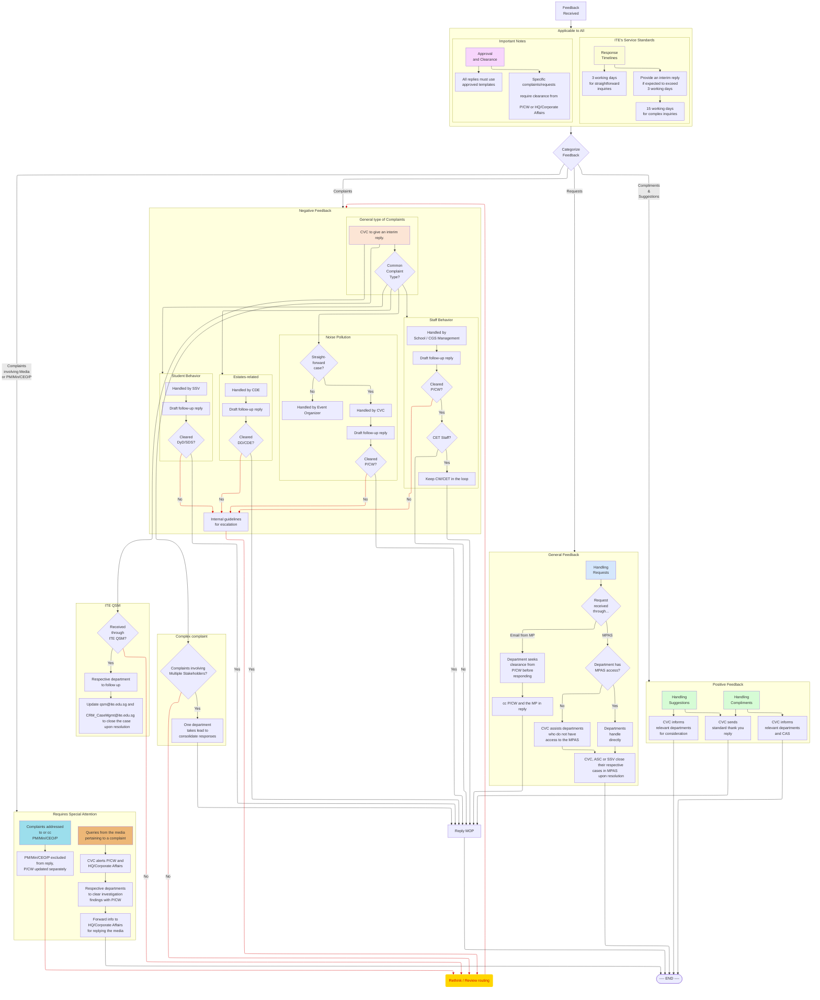

```mermaid

flowchart-elk TD

 subgraph subGraph0["ITE's Service Standards"]
        G1["3 working days 
                        for straightforward 
                        inquiries"]
        G["Response 
   Timelines"]
        G2["Provide an interim reply 
            if expected to exceed 
            3 working days"]
        G3["15 working days 
            for complex inquiries"]
  end
 subgraph subGraph1["Important Notes"]
        H1["All replies must use 
                                    approved templates"]
        H["Approval 
    and Clearance"]
        H2["Specific complaints/requests 
                                    require clearance from 
                                    P/CW or HQ/Corporate Affairs"]
  end
 subgraph X["Applicable to All"]
        subGraph0
        subGraph1
  end
 subgraph Q["Positive Feedback"]
        C1["CVC sends 
        standard thank you 
        reply"]
        C["Handling 
                    Compliments"]
        C2["CVC informs 
        relevant departments 
        and CAS"]
        D["Handling 
                    Suggestions"]
        D2["CVC informs 
        relevant departments 
        for consideration"]
  end
 subgraph R["General Feedback"]
        F1{"Request 
            received 
            through..."}
        F["Handling 
    Requests"]
        F2{"Department has 
                MPAS access?"}
        F3["Departments 
                handle 
                directly"]
        F4["CVC assists departments 
    who do not have 
    access to the MPAS"]
        F5["Department seeks 
                    clearance from 
                    P/CW before 
                    responding"]
        F5a["cc P/CW and the MP in reply"]
        F6["CVC, ASC or SSV close 
            their respective cases in MPAS
            upon resolution"]
  end
 subgraph W["General type of Complaints"]
        E["CVC to give an interim reply."]
        E1{"Common
        Complaint 
        Type?"}
  end
 subgraph M["Student Behavior"]
        E19["Draft follow-up reply"]
        E2["Handled by SSV"]
        E19a{"Cleared 
                DyD/SDS?"}
  end
 subgraph N["Estates-related"]
        E20["Draft follow-up reply"]
        E6["Handled by CDE"]
        E20a{"Cleared 
                DD/CDE?"}
  end
 subgraph O["Staff Behavior"]
        E7["Handled by 
School / CGS Management"]
        E7a["Draft follow-up reply"]
        E7b{"Cleared 
                P/CW?"}
        E7c{"CET Staff?"}
        E7e["Keep CW/CET in the loop"]
  end
 subgraph P["Noise Pollution"]
        E3{"Straight-
    forward 
    case?"}
        E4["Handled by CVC"]
        E5["Handled by Event Organizer"]
        E4a["Draft follow-up reply"]
        E4b{"Cleared 
                P/CW?"}
  end
 subgraph S["Negative Feedback"]
        E4d["Internal guidelines 
        for escalation"]
        W
        M
        N
        O
        P
  end
 subgraph U["Complex complaint"]
        E10{"Complaints involving 
            Multiple Stakeholders?"}
        E11["One department 
                    takes lead to 
                    consolidate responses"]
  end
 subgraph V["ITE QSM"]
        E16{"Received 
            through 
            ITE QSM?"}
        E17["Respective department 
                    to follow up"]
        E18["Update qsm@ite.edu.sg and 
            CRM_CaseMgmt@ite.edu.sg 
            to close the case 
            upon resolution"]
  end
 subgraph T["Requires Special Attention"]
        T1["Queries from the media 
    pertaining to a complaint"]
        T1a["CVC alerts P/CW and 
            HQ/Corporate Affairs"]
        T1b["Respective departments 
            to clear investigation 
            findings with P/CW"]
        T1c["Forward info to 
            HQ/Corporate Affairs 
            for replying the media"]
        T2["Complaints addressed 
    to or cc 
    PM/Min/CEO/P"]
        T2a["PM/Min/CEO/P excluded 
                    from reply, 
                    P/CW updated separately"]
  end
    G --> G1 & G2
    G2 --> G3
    H --> H1 & H2
    A["Feedback 
    Received"] --> X
    X --> B{"Categorize 
Feedback"}
    B -- Compliments 
        & 
        Suggestions --> Q
    B -- Complaints --> S
    B -- Complaints 
        involving Media 
        or PM/Min/CEO/P --> T
    B -- Requests --> R
    C --> C1 & C2
    D --> C1 & D2
    F --> F1
    F1 -- MPAS --> F2
    F2 -- Yes --> F3
    F2 -- No --> F4
    F1 -- Email from MP --> F5
    F5 --> F5a
    F3 --> F6
    F4 --> F6
    E19a -- No --> E4d
    E20a -- No --> E4d
    E7b -- No --> E4d
    E --> E1 & E10 & E16
    E1 --> M & N & O & E3
    E2 --> E19
    E19 --> E19a
    E6 --> E20
    E20 --> E20a
    E7 --> E7a
    E7a --> E7b
    E7b -- Yes --> E7c
    E7c -- Yes --> E7e
    E3 -- Yes --> E4
    E3 -- No --> E5
    E4 --> E4a
    E4a --> E4b
    E10 -- Yes --> E11
    E16 -- Yes --> E17
    E17 --> E18
    T1 --> T1a
    T1a --> T1b
    T1b --> T1c
    T2 --> T2a
    F5a --> E4c["Reply MOP"]
    E19a -- Yes --> E4c
    E20a -- Yes --> E4c
    E7c -- No --> E4c
    E7e --> E4c
    E4b -- Yes --> E4c
    E4b -- No --> E4d
    C1 --> E4c
    E11 --> E4c
    E10 -- No --> Z1("Rethink / Review routing")
    E16 -- No --> Z1
    E4d --> Z1
    T2a --> Z1
    Z1 --> S
    T1c --> ZZ(["---- END ----"])
    E4c --> ZZ
    F6 --> ZZ
    C2 --> ZZ
    D2 --> ZZ
    style G fill:#fcfcd5
    style H fill:#f7d5fc
    style C fill:#d6fcd5
    style D fill:#d6fcd5
    style F fill:#d5e7fc
    style E fill:#fce5d5
    style T1 fill:#edb777
    style T2 fill:#9cdeec
    style Z1 color:#D50000,stroke:none,fill:#FFD600
    linkStyle 23 stroke:#D50000,fill:none
    linkStyle 24 stroke:#D50000,fill:none
    linkStyle 25 stroke:#D50000
    linkStyle 58 stroke:#D50000,fill:none
    linkStyle 61 stroke:#D50000,fill:none
    linkStyle 62 stroke:#D50000,fill:none
    linkStyle 63 stroke:#D50000,fill:none
    linkStyle 64 stroke:#D50000,fill:none
    linkStyle 65 stroke:#D50000,fill:none

```
