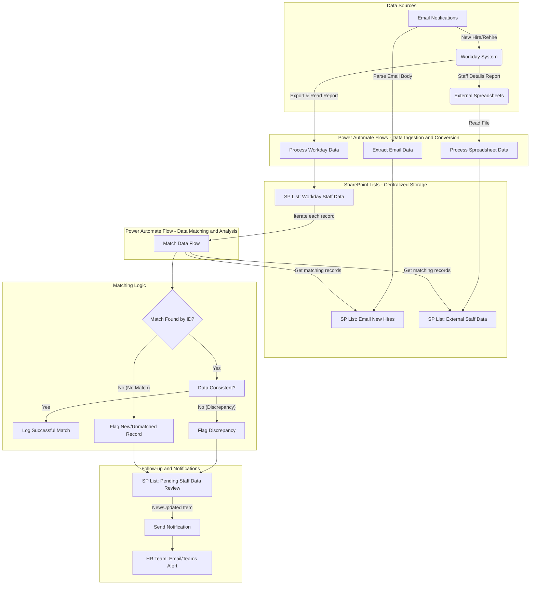

```mermaid
graph TD
    subgraph Data Sources
        A[Email Notifications] -->|New Hire/Rehire| B(Workday System)
        B -->|Staff Details Report| C(External Spreadsheets)
    end

    subgraph Power Automate Flows - Data Ingestion and Conversion
        A -- Parse Email Body --> PA1[Extract Email Data]
        B -- Export & Read Report --> PA2[Process Workday Data]
        C -- Read File --> PA3[Process Spreadsheet Data]
    end

    subgraph SharePoint Lists - Centralized Storage
        PA1 --> SP1[SP List: Email New Hires]
        PA2 --> SP2[SP List: Workday Staff Data]
        PA3 --> SP3[SP List: External Staff Data]
    end

    subgraph Power Automate Flow - Data Matching and Analysis
        SP2 -- Iterate each record --> PA4[Match Data Flow]
        PA4 -- Get matching records --> SP1
        PA4 -- Get matching records --> SP3
    end

    subgraph Matching Logic
        PA4 --> D{Match Found by ID?}
        D -- Yes --> E[Data Consistent?]
        E -- Yes --> F[Log Successful Match]
        E -- No (Discrepancy) --> G[Flag Discrepancy]
        D -- No (No Match) --> H[Flag New/Unmatched Record]
    end

    subgraph Follow-up and Notifications
        G --> SP4[SP List: Pending Staff Data Review]
        H --> SP4
        SP4 -- New/Updated Item --> PA5[Send Notification]
        PA5 --> I[HR Team: Email/Teams Alert]
    end


```
