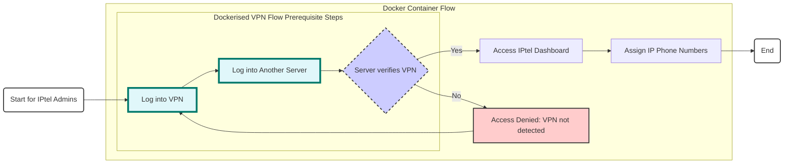

```mermaid

graph LR
    A(Start for IPtel Admins)
    A --> B

    subgraph Docker Container Flow
        subgraph Dockerised VPN Flow Prerequisite Steps
            B[Log into VPN]:::vpnstep --> C[Log into Another Server]:::vpnstep
            C --> D{Server verifies VPN}:::vpnstep
        end
        D -- Yes --> E[Access IPtel Dashboard]
        E --> F[Assign IP Phone Numbers]
        
        D -- No --> H[Access Denied: VPN not detected]
        H --> B
    end
        F --> G(End)

    classDef vpnstep fill:#e0f7fa,stroke:#00796b,stroke-width:4px
    class B,C,D vpnstep
    style D fill:#ccf,stroke:#333,stroke-width:2px,stroke-dasharray: 5 5
    style H fill:#fcc,stroke:#333,stroke-width:2px
    style A fill:#fff,stroke:#333,stroke-width:2px
    style G fill:#fff,stroke:#333,stroke-width:2px

```
