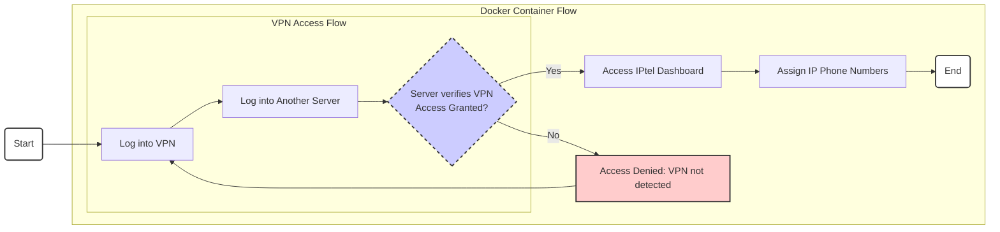

```mermaid

graph LR
    A(Start)
    A --> B

    subgraph Docker Container Flow
        subgraph VPN Access Flow
            B[Log into VPN] --> C[Log into Another Server]
            C --> D{Server verifies VPN<br/>Access Granted?}
        end
        D -- Yes --> E[Access IPtel Dashboard]
        E --> F[Assign IP Phone Numbers]
        F --> G(End)
        D -- No --> H[Access Denied: VPN not detected]
        H --> B
    end

    style A fill:#fff,stroke:#333,stroke-width:2px
    style G fill:#fff,stroke:#333,stroke-width:2px
    style D fill:#ccf,stroke:#333,stroke-width:2px,stroke-dasharray: 5 5
    style H fill:#fcc,stroke:#333,stroke-width:2px
```
