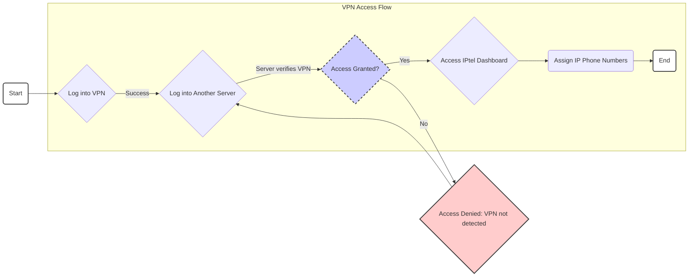

```mermaid

graph LR
    A(Start) --> B{Log into VPN};

subgraph VPN Access Flow
    B -- Success --> C{Log into Another Server};
    C -- Server verifies VPN --> D{Access Granted?};
    D -- Yes --> E{Access IPtel Dashboard};
    E --> F(Assign IP Phone Numbers);
    F --> G(End);
 %% If there are more steps between login and access granted, add them here
  end
    D -- No --> H{Access Denied: VPN not detected};
    H --> C;
    style A fill:#fff,stroke:#333,stroke-width:2px
    style G fill:#fff,stroke:#333,stroke-width:2px
    style D fill:#ccf,stroke:#333,stroke-width:2px,stroke-dasharray: 5 5
    style H fill:#fcc,stroke:#333,stroke-width:2px


```
