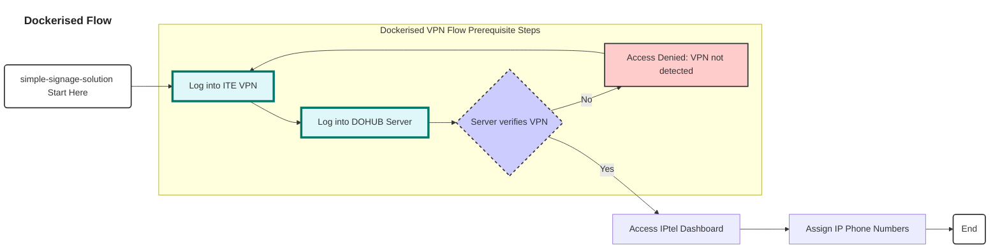

# simple-signage-solution Dockerised Flow

```mermaid

    graph LR
    Title["<b>Dockerised Flow</b>"]:::title
    Title 
    A(simple-signage-solution Start Here)
    A --> B

    subgraph Dockerised VPN Flow Prerequisite Steps
        B[Log into ITE VPN]:::vpnstep --> C[Log into DOHUB Server]:::vpnstep
        C --> D{Server verifies VPN}:::vpnstep
        D -- No --> H[Access Denied: VPN not detected]
    end

    D -- Yes --> E[Access IPtel Dashboard]
    E --> F[Assign IP Phone Numbers]
    F --> G(End)
    H --> B

    classDef title fill:#fff,stroke:#fff,color:#222,font-size:20px
    classDef vpnstep fill:#e0f7fa,stroke:#00796b,stroke-width:4px
    class B,C,D vpnstep
    style D fill:#ccf,stroke:#333,stroke-width:2px,stroke-dasharray: 5 5
    style H fill:#fcc,stroke:#333,stroke-width:2px
    style A fill:#fff,stroke:#333,stroke-width:2px
    style G fill:#fff,stroke:#333,stroke-width:2px


```
